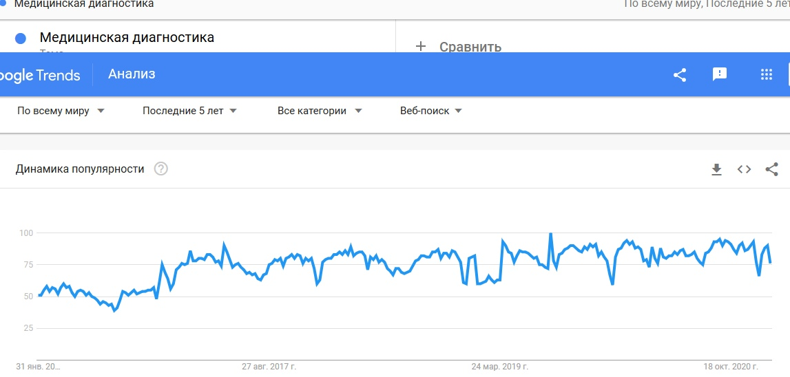
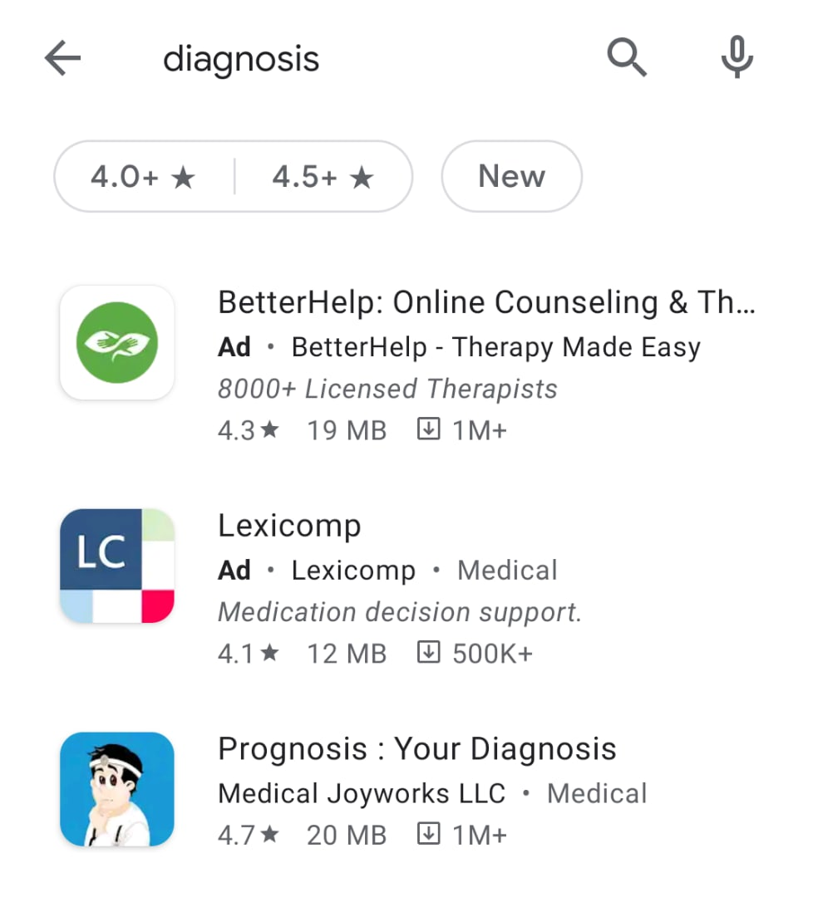
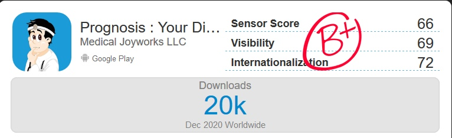
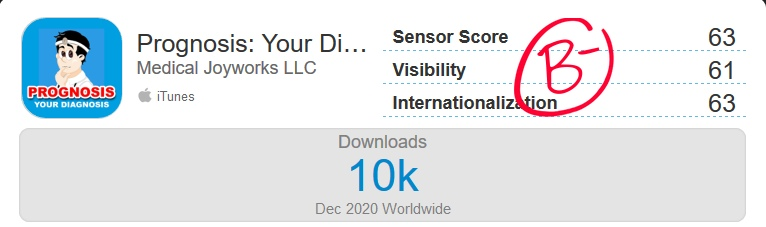
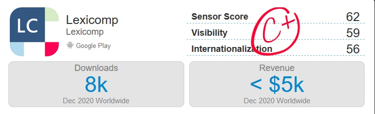
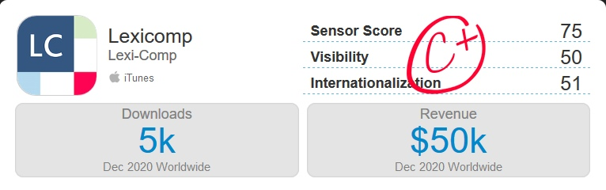
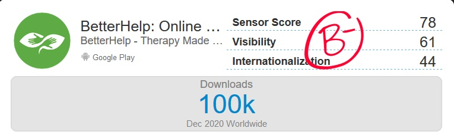
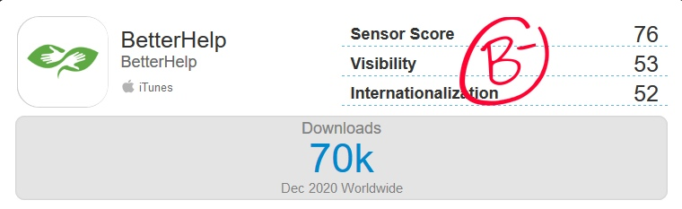

# Анализ рынка
На основе анализа поисковых запросов с 2015 по 2020 год, был сделан вывод, что пользователи интересуются темой медицинской диагностики - смотрите рисунок 1.  **
(*Источник: https://trends.google.ru/trends/*)

*Числа обозначают уровень интереса к теме по отношению к наиболее высокому показателю в таблице для определенного региона и периода времени. 100 баллов означают наивысший уровень популярности запроса, 50 – уровень популярности запроса, вдвое меньший по сравнению с первым случаем. 0 баллов означает местоположение, по которому недостаточно данных о рассматриваемом запросе.*

**Приложение-ассистент для диагностики** имеет следующий функционал: с помощью этого приложения (с подтверждёнными результатами исследований, рецензируемых в десятках профильных изданий) практикующий врач имеет возможность перепроверить диагноз. 

Рассмотрим **топ-3** приложения для андройда по тематике диагностики и их статистику:
1. Prognosis: Your Diagnosis - 1+ миллион скачиваний
2. BetterHelp - 1+ миллион скачиваний
3. Lexicomp - 500+ тысяч скачиваний

(*Источник: Google Play*)  

# Статистика

Рассмотрим статистику по каждому приложению соответственно:  
(*Источник: https://sensortower.com/*)

## Prognosis: Your Diagnosis

Статистика для 

Из статистики мы можем сделать вывод, что приложение, только за последний месяц было суммарно скачано более 30 тысяч раз.

## Lexicomp

Скачано 13 тысяч раз при общем скачивании более 500 тысяч и имеет прибыль более 55$ за месяц. 

## BetterHelp

Скачано 170 тысяч раз за месяц.

# Монетизация

Рассмотрим возможности монетизации: 
(*Источник: https://www.imena.ua/blog/best-med-apps/*)

1. Реклама внутри приложения
2. Платная подписка для пользователей предлагающая дополнительные функциональные возможности: портал пациента и персональный домен. Однако и обычная бесплатная версия позволяет поддерживать контакт с пациентом вне работы. 
3. Платная подписка для организаций: общая база данных пациентов клиники и систематизация их личной информации

# Заключение

Из приведенных выше данных можно сделать вывод, что приложение этой сферы пользуется популярность среди пользователей. Кроме того, есть тренд на увеличение популярности данных приложений.  
Таким образом, разработка **приложение-ассистент для диагностики** является перспективным с точки зрения рынка.

