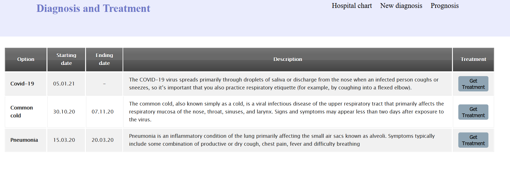
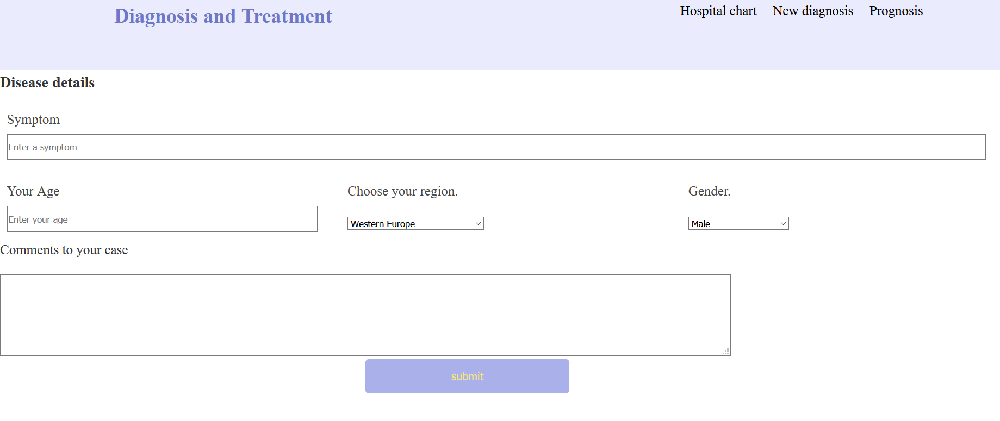
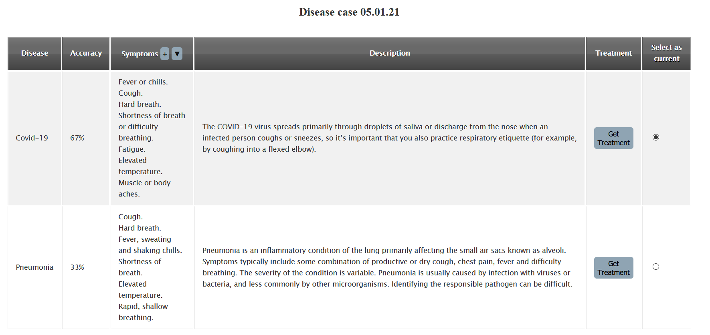
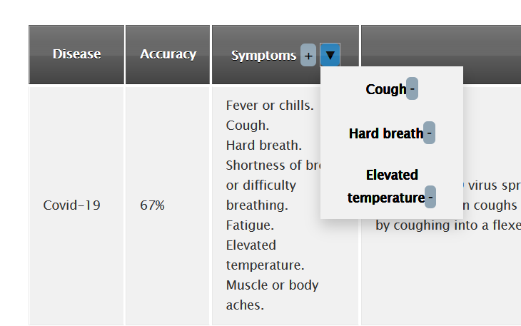

# Приложение ассистент для диагностирования

При разработке медицинских приложений для диагностики используются разнообразные программные средства, перед нами стоит задача их специфицировать.  
В предыдущей лабораторной работе было решено, что программный продукт будет представлять из себя веб-приложение, использующее нейронные сети для диагностики диагнозов пациентов, для хранения пользовательских данных и вычислений будут использоваться удаленные сервера.
Рассмотрим отельно функционал приложения, который будет обеспечиваться тремя составляющими:
1. Веб-оболочкой
2. Алгоритмом диагностики на серверной части
3. Базой данных, содержащей информацию
    * данные о заболевании
    * данные о лечении
    * историю болезни пациента

## Функционал

Приложение будет функционировать по следующей схеме: пользователь заполняет форму, описывая свои симптомы и уточняет их (например, указывает вид кашля), после чего форма отправляется на сервер. Алгоритм обрабатывает данные пациента и делает прогноз: составляет список возможных заболеваний и их вероятность. После чего результаты отправляются пользователю, вместе со стратегией лечения.  
Отдельной частью функционала приложения является возможность позвонить врачу и проконсультироваться с ним.

### История болезни пациента

Благодаря тому, что приложение использует сервера для хранения информации, появляется возможность вносить историю болезни в базу данных, для того, чтобы в будущем представлять в удобное для пользователя виде, его историю болезни.  
Основные пункты, отображаемые в таблице:
1. Название болезни
2. Дата ее начала о окончания
3. Описание
3. Возможность ознакомиться с лечением, предлагаемым врачем в общем виде.

### Диагностика 

Для диагностики с помощью приложения пользователю надо будет записать симптомы в порядке их появления и, в случае необходимости,уточняет их. Полученные данные будут отправляться на сервер, где обученная нейронная сеть поставит возможные варианты болезни с проставлением процентов, какая болезнь вероятнее всего у пациента. 
Для более точной диагностики пользователю также необходимо будет указать свой пол, возраст и область проживания.

После этого, пользователь может ознакомиться со список предполагаемых заболеваний и выбрать одной из них, после экспертной оценки специалиста, либо же самостоятельно. Выбор можно будет изменить, пока болезнь еще идет, в случае врачебной ошибки.

Также, при появлении новых симптомов, пользователь сможет отмечать их появление с помощью программы.

### Лечение

После того, как нейронная сеть предоставила возможные болезни, пользователь выбирает одну из них и приложение показывает способы лечения выбранной болезни с учетом ее тяжести, благодаря "календарю" появления симптомов. Если лечить болезнь категорически противопоказано домашними методами и простыми медпрепаратами, то приложение порекомендует обратиться к врачу.

 

### Консультация с врачом 
Приложение будет предоставлять возможность обмениваться с врачом текстовыми сообщениями и фотографиями. Таким образом пользователь сможет уточнить свой диагноз, если он сомневается в результате, который предоставила нейронная сеть. В случае необходимости они смогут договорится о звуко- и видеосвязи через сторонние сервисы.

---

## Средства разработки

Рассмотрим как сами средства, с помощью которых будет функционировать приложение, так и среду его разаботки.

### ASP .Net Core

ASP.NET Core — свободно-распространяемый кросс-платформенный фреймворк для создания веб-приложений с открытым исходным кодом. Данная платформа разрабатывается компанией Майкрософт совместно с сообществом и имеет большую производительность по сравнению с ASP.NET.  
Для реализации веб-части приложения мы будем использовать Net core 3.1. 

Приемущества: 
* Архитектурный шаблон MVC. Взаимодействие пользователя с приложением MVC осуществляется в соответствии с естественным циклом: пользователь предпринимает действие, в ответ на которое приложение изменяет свою модель данных и доставляет обновленное представление пользователю. Затем цикл повторяется. Это хорошо укладывается в схему веб-приложений, предоставляемых в виде последовательностей запросов и ответов HTTP
* Расширяемость. Инфраструктура MVC Framework построена в виде набора независимых компонентов, которые удовлетворяют интерфейсу .NET или созданы на основе абстрактного базового класса. Компоненты, подобные системе маршрутизации, механизму визуализации и фабрике контроллеров, можно легко заменять другими компонентами с собственной реализацией.
* Жесткий контроль над HTML и HTTP. Инфраструктура ASP.NET MVC генерирует ясный и соответствующий стандартам код разметки. Ее встроенные вспомогательные методы HTML производят соответствующий стандартам вывод, но существует также гораздо более значимое философское изменение по сравнению с Web Forms. Вместо генерации громадного объема трудно поддающейся управлению HTML-разметки инфраструктура MVC Framework стимулирует создание простых и элегантных элементов, оформленных стилями CSS.
* Тестируемость. Естественное разделение различных ответственностей приложения по независимым друг от друга частям программного обеспечения, которое поддерживается архитектурой MVC, позволяет изначально строить легко сопровождаемые и тестируемые приложения. Однако проектировщики ASP.NET MVC на этом не остановились. Для каждого фрагмента компонентно-ориентированного проекта инфраструктуры они обеспечили структурированность, необходимую для удовлетворения требований модульного тестирования и средств имитации.

### MySQL

В качестве системы управления базами данных был выбран MySql.
MySQL — свободная реляционная система управления базами данных и является хорошим решением для небольших и средних приложений. Является наиболее приспособленной для применения в среде web СУБД.

Основные преимущества MySQL:
* многопоточность, поддержка нескольких одновременных запросов;
* оптимизация связей с присоединением многих данных за один проход;
* записи фиксированной и переменной длины;
* гибкая система привилегий и паролей;
* гибкая поддержка форматов чисел, строк переменной длины и меток времени;
* интерфейс с языками C и Perl, PHP;
* быстрая работа, масштабируемость;

### Visual Studio 2019

Visual Studio 2019 была выбрана в качестве среды разработки, так как она является наиболее удобным инструментом для работы с ASP .NET. Эта среда позволяет предоставляет удобное средство для установки и обновления пакетов и библиотек - nuget.

Visual Studio включает в себя редактор исходного кода с поддержкой технологии IntelliSense и возможностью простейшего рефакторинга кода. Встроенный отладчик может работать как отладчик уровня исходного кода, так и отладчик машинного уровня. Остальные встраиваемые инструменты включают в себя редактор форм для упрощения создания графического интерфейса приложения, веб-редактор, дизайнер классов и дизайнер схемы базы данных. Visual Studio позволяет создавать и **подключать сторонние дополнения** (плагины) для расширения функциональности практически на каждом уровне, включая добавление поддержки **систем контроля версий исходного кода** (как, например, Subversion и Visual SourceSafe)

### TensorFlow

Для реализации алгоритмов для диагностирования, будет использован фреймворк глубоко обучения TensorFlow версии TensorFlow Core v2.4.1.

TensorFlow — открытая программная библиотека для машинного обучения, разработанная компанией Google для решения задач построения и тренировки нейронной сети с целью автоматического нахождения и классификации образов, достигая качества человеческого восприятия. Применяется как для исследований, так и для разработки собственных продуктов Google. Основной API для работы с библиотекой реализован для Python, также существуют реализации для R, C Sharp, C++, Haskell, Java, Go и Swift. 

Плюсы TensorFlow:
* Простой встроенный высокоуровневый API.
* Многофункциональный
* Хорошая поддержка под мобильные устройства.
* Подробная документация.

---

 

## Заключение

Приложение будет позволять пользователям функционал для диагностики заболеваний, для чего пользователю необходимо будет указать свои симптомы, пол, возраст и область проживания. После чего пользователь получит список вероятных диагнозов. Все эти данные будут сохраняться в личную историю болезни пациента, которая будет доступна для просмотра.

Как основной инструмент веб-разработки был выбран ASP .NET core, в качестве СУБД будет выступать MySQL, кроме того приложение будет использовать разработанную с помощью TensorFlow модель, используемую для диагностики. 